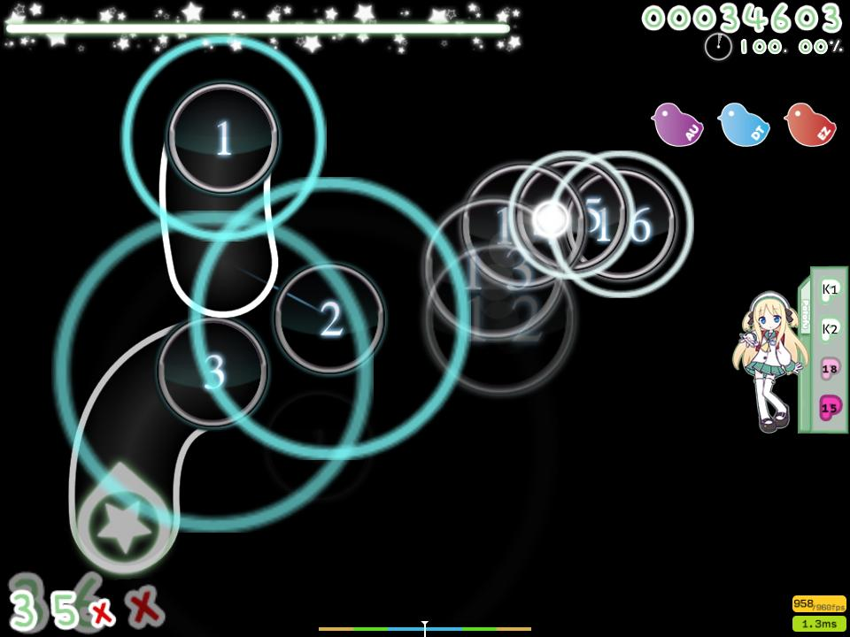
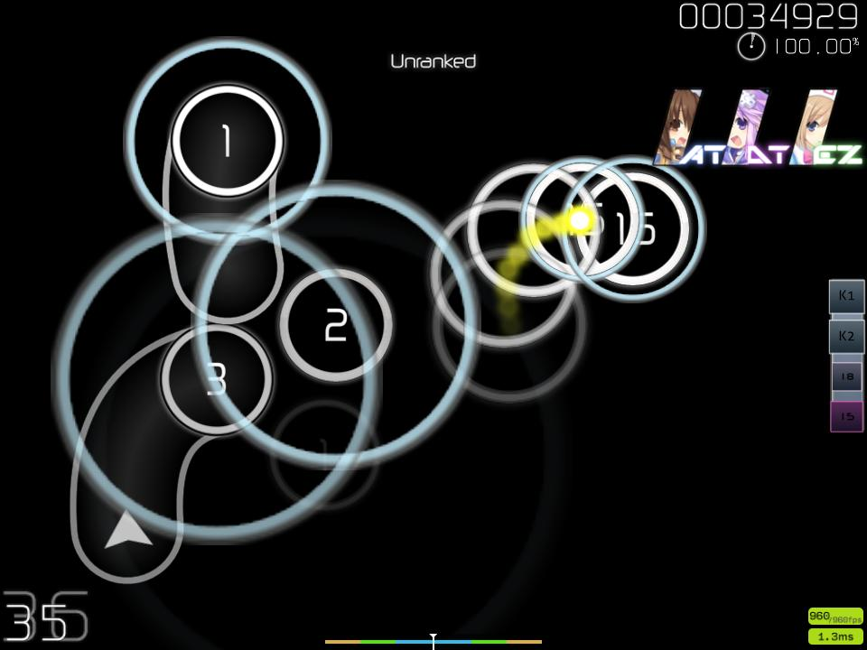

# hinami-chi-skins

IF ANY ZELDA IS NOT WORKING PLEASE TELL ME FOR FIX IT :V

# [my drive with latests skins](https://drive.google.com/drive/folders/19QmmP7DTI1yNsr-K4JN9KtHnMoKdqDg3)
# [hinami-chi's v1.1 2025-12-15 22:16.osk.osk](https://drive.google.com/file/d/1GPScGXoIQgEBXTqLAKObYDxNEqf6rMpL/view?usp=drivesdk)

# [hinami-chi's v1.1 2025-12-04 19:40.osk](https://drive.google.com/file/d/1pJOFcsJLWpC4xT88fVD6rGg09_KgtTOx/view?usp=drivesdk)

# [- [Ryosuke + KecHik445] Kamui HQ 2025-11-30 16:38.osk](https://drive.google.com/file/d/1wWahbLnxuyYf3kJWFpsdKq74AwLNIfvz/view?usp=drivesdk)

# [Sakura Card Captor -Skin-By Lulu-Lala 2025-11-30 13:06.osk](https://drive.google.com/file/d/13gMlDJbD6l51Le3WUXy5UNvZZJd1gjUd/view?usp=drivesdk)

# [ur4ra+skin+cocoro 2025-11-30 13:02.osk](https://drive.google.com/file/d/1jj2BOyeLoGGpuir-TEvmy_e9fWyLlQiq/view?usp=drivesdk)

# [amatarasu skin 2025-11-30 13:01.osk](https://drive.google.com/file/d/1pRdi3-6-5sH4RuNXaJhUqzvk0L5Gb3tp/view?usp=drivesdk)

# [Heatherfield 2025-11-30 12:58.osk](https://drive.google.com/file/d/14wA5wdqyLJBalWaZdt9ZkjuTWlZUbTXN/view?usp=drivesdk)

# [hinami-chi's v1.1 2025-11-26 21:22.osk](https://drive.google.com/file/d/1lLUiAOL9Eds6-E5ais3lnx8HT4OSAJDu/view?usp=drivesdk)

# [hinami-chi's v1.1 2025-11-21 22:55.osk](https://drive.google.com/file/d/1xp6TpCUSMqPSqE5Ip2pdUiueK2NC1-j3/view?usp=drivesdk)

# [+hinami-chi's v5.0+ 2025-10-07 00:01.osk](https://drive.google.com/file/d/17-CG7CRAXkuiL9kS9HxThlMkjSU4jhx1/view?usp=drivesdk)

# [hinami-chi's v3.1 2025-09-21 12:29.osk](https://drive.google.com/file/d/1JfHhVMKdeDEPoqy38_ZP2MnHIZy9c3pK/view?usp=sharing)

# [azerino Potofu 2.12 2025-09-14 00:04.osk](https://drive.google.com/file/d/1YCtI14OYPZKh5n8aplUa0pztwMvm3svO/view?usp=drivesdk)

# [azerino Potofu 2.12 2025-09-06 21:46.osk](https://drive.google.com/file/d/1ahhOqcSlqgJiKPm0uH3sQUc0E2g9elfn/view?usp=sharing)

# [hinami-chi's v3.1 hr nm 2025-06-11 13:43.osk](https://drive.google.com/file/d/1D-f1h2dLykLqCfN5RyLiq5ZOPufTAvMx/view?usp=sharing)

# [hinami-chi_s v3.1 ez gordo](https://drive.google.com/file/d/1kgffw0qSP2HYhBfsIp9wK4EC-qSh58mU/view?usp=sharing)

# [hinami-chi's v3.1 hr nm gordo 2025-05-31 14:20.osk](https://drive.google.com/file/d/1fk2Wltsh-zDuyO7U5eKGtbEumi3gmGhM/view?usp=drivesdk)

# [hinami-chi_s v3.1 cursor gordo](https://drive.google.com/file/d/1Wr16GZDOSzpoaSVffXOa-PiKURbGvqj6/view?usp=sharing)

# [hinami-chi's v3.1 2025-03-17 23:37.osk](https://drive.google.com/file/d/12IJp-lDICs9opFtnna0EvA1sDc6rUFpI/view?usp=drivesdk)

# [Azurondres 2 2025-02-11](https://drive.google.com/file/d/1ejRgA13MlulDQjThMniJIdDZPyPZ6tAp/view?usp=sharing)

# [azerino Potofu 2.1 2025-02-02 23:35.osk](https://drive.google.com/file/d/1eLWrCeakXbDbG5UZMmd3fsDxcp5rBiGl/view?usp=drivesdk)

# [azerino Potofu HR white hitsounds 2025-01-26 18:59.osk](https://drive.google.com/file/d/1XW6OouKBcHrmCbjbvdOb12sn3tmjE70k/view?usp=drivesdk)

# [azerino Potofu HR white 2025-01-26 12:44.osk](https://drive.google.com/file/d/1f_siVkDk8a0RxIBgui9O45E22DCY57mO/view?usp=sharing)

# [hinami-chi's v3.1 2025-01-19 21:57.osk](https://drive.google.com/file/d/1dWf9UY9EcQP4S6XpAqiZtvwetuXJyQ47/view?usp=sharing)

# [hinami-chi_s v3.1 2024-11-18 17:54.osk](https://drive.google.com/file/d/171-OtDygkaMS11j3F1JkB8GoMhgFZ25P/view?usp=sharing)

# [Potofu 2024-11-07](https://drive.google.com/file/d/1Li4MMpA7iRh67zt_36YxnuSknTodN1kV/view?usp=sharing)

# [azerino Potofu 2.1 yellow 2024-11-05 02:58.osk](https://drive.google.com/file/d/1pryy4lBKTBuEe4F_387p1dzauNqj4lCd/view?usp=sharing)

# [indekusu 2024-11-02](https://drive.google.com/file/d/16VYfigYDRpO_e_yQZ0sWO4nZLAprPQEI/view?usp=sharing)

# [Prawilnosc+v+998+DT 2024-10-20 15:04.osk](https://drive.google.com/file/d/18EndlUXk3bZrxmIRFI_pOB1pu6HPtboZ/view?usp=sharing)

# [hinami-chi nahida skin AR 2024-10-03 20:54.osk](https://drive.google.com/file/d/1gXbjQjts6ynfSsPLttP1heKLVdWgVNhI/view?usp=sharing)

# [hinami-chi nahida skin 2024-09-21 23:32.osk](https://drive.google.com/file/d/1xoJxBMMpB5rtNh3SiovhQlUApa_vqBoF/view?usp=sharing)

# [baka](https://drive.google.com/file/d/1xxIuCBIzMHHc-CVNbzk6bNRTH-671-ni/view?usp=sharing)

# [hinami-chi nahida skin 2024-09-15 23:46.osk](https://drive.google.com/file/d/1xxIuCBIzMHHc-CVNbzk6bNRTH-671-ni/view?usp=sharing)

# [hinami edit (Siiphs skin) 2024-08-28 23:40.osk](https://drive.google.com/file/d/12v87jRgvUaIWFKsVKvUGpfTUVydLYNdk/view?usp=sharing)
%202024-08-28%2023_40.jpg)

# [hinami-chi can play hidden yellow 2024-08-28 23:40.osk](https://drive.google.com/file/d/1lBIirWufVd-77YosErBmxnWhCAQ1PzRA/view?usp=sharing)

# [hinami-chi_s v1.1 edit 2024-08-10 23:58.osk](https://drive.google.com/file/d/1ieNNeY1Hs2MkvTUBcFX8SoN-hhGo7SkE/view?usp=sharing)

# [azerino Potofu 2.3 2024-07-21 20:56.osk](https://drive.google.com/file/d/1rqL2yDR9mfwKh-Pso9khyy9pabe1rXIA/view?usp=sharing)

# [azerino Potofu 2.3 2024-05-21 22:32.osk](https://drive.google.com/file/d/1NpvOK-3mJDiRWmm4eyw9kQbySBWFrtwb/view?usp=sharing)

# [a+Nahida+Skin v0.1 2024-05-12 20:20.osk](https://drive.google.com/file/d/1j8K35RrnwQjlv9rzxpK9r_hmpm5MNqZu/view?usp=drive_link)

# [azerino Potofu 2.3 2024-05-11 21:26.osk](https://drive.google.com/file/d/1NnpXIptQX3_vobrvU_72Ga4UMTxYkOs6/view?usp=drive_link)

# [WWW v1.6 2024-05-11 18:38.osk](https://drive.google.com/file/d/1HVwimDa02WPtvC--E2w35frxL5qunjwS/view?usp=drive_link)

# [hinami-chi_s v1.1 2024-05-10 22:50.osk](https://drive.google.com/file/d/1WRSTs_ku85OkQBlaMwRu8wQu7iwyMvhx/view?usp=drive_link)

# [dddddomgforz 2024-05-07 21:19.osk](https://drive.google.com/file/d/1m4Uv_yh3aSgdDcdwHtGzaJZsUmSeqq_7/view?usp=sharing)

# [hinami-chi v1.4.1](https://github.com/hinami-chi/hinami-chi-skins/raw/main/osk/hinami-chi%20v1.4.1.osk)

# [hinami-chi v1.4](https://github.com/hinami-chi/hinami-chi-skins/raw/main/osk/hinami-chi%20v1.4.osk)

# [hinami-chi v4.0](https://github.com/hinami-chi/hinami-chi-skins/raw/main/osk/hinami-chi%20v4.0.osk)

# [hinami-chi DT high AR](https://github.com/hinami-chi/hinami-chi-skins/raw/main/osk/hinami-chi%20DT%20high%20AR.osk)

# [hinami-chi v1.3.4](https://github.com/hinami-chi/hinami-chi-skins/raw/main/osk/hinami-chi%20v1.3.4.osk)
Changelog: 
+ ranking.png changed (zeluaR letters rank)
+ cursor.png [changed](https://i.imgur.com/xYqCgIG.png) ; cursortrail.png invisible
+ play-skip.png [changed](https://cdn.discordapp.com/attachments/787140086151774248/801878314431283270/play-skip.png)
+ SliderBorder: 51,101,150 ; SliderTrackOverride: 0,0,30

# [hinami-chi v1.3.3](https://github.com/hinami-chi/hinami-chi-skins/raw/main/osk/hinami-chi%20v1.3.3.osk)
Changelog:
+ sliderb0 changed
+ hitsounds changed
+ old yellow cursor
+ old hitcircles
+ default changed (hitcircle number)
+ sliderfollowcircle = invisible
+ SDLG dota osu peru [selection-options.png](https://i.ibb.co/JvPw356/selection-options.png)
+ rafis spinner

# [Rafis DT hinami-chi edit (DT AR10.3 skin)](https://1drv.ms/u/c/7c33ddd50e85ce04/EQTOhQ7V3TMggHxmBwAAAAABl7NZZ0ac_OuuIyJnOpeACA?e=9Nek5s)
Changelog:
+ sliderb0.png v1.3.3
+ sliderfollowcircle = invisible
+ SliderBorder: 253,199,244; SliderTrackOverride: 8,5,23
+ old yellow cursor
+ followpoints changed
+ default changed (hitcircle number v1.3.3)
+ hitsounds v1.3.3

# [Arnold24x24 hinami-chi edit (HD skin)](https://github.com/hinami-chi/hinami-chi-skins/raw/main/osk/Arnold24x24%20hinami-chi%20edit.osk)
Changelog:
+ sliderb0.png v1.3.3
+ sliderfollowcircle = invisible
+ SliderBorder: 253,199,244; SliderTrackOverride: 8,5,23
+ old yellow cursor

# [TaskuSkin v7 hinami-chi edit.osk](https://github.com/hinami-chi/hinami-chi-skins/raw/main/osk/TaskuSkin%20v7%20hinami-chi%20edit.osk)

# [hinami-chi v1.3.2](https://github.com/hinami-chi/hinami-chi-skins/raw/main/osk/hinami-chi%20v1.3.2.osk)

# [hinami-chi v1.3.1](https://github.com/hinami-chi/hinami-chi-skins/raw/main/osk/hinami-chi%20v1.3.1.osk)

# [hinami-chi v1.3](https://github.com/hinami-chi/hinami-chi-skins/raw/main/osk/hinami-chi's%20v1.3.osk)

# [Dheani's Skin (hinami-chi edit)](https://github.com/hinami-chi/hinami-chi-skins/raw/main/osk/Dheani's%20Skin%20(hinami-chi%20edit).osk)

# [VaxeiEZHD](https://github.com/hinami-chi/hinami-chi-skins/raw/main/osk/VaxeiEZHD.osk)

# [hinami-chi v3.0](https://github.com/hinami-chi/hinami-chi-skins/raw/main/osk/hinami-chi's%20v3.0.osk)

# [hinami-chi v2.2](https://github.com/hinami-chi/hinami-chi-skins/raw/main/osk/hinami-chi%20v2.2.osk)

# [hinami-chi v2.1](https://github.com/hinami-chi/hinami-chi-skins/raw/main/osk/hinami-chi%20v2.1.osk)

# [hinami-chi v2.0](https://github.com/hinami-chi/hinami-chi-skins/raw/main/osk/hinami-chi%20v2.0.osk)

# [hinami-chi's v1.2](https://github.com/hinami-chi/hinami-chi-skins/raw/main/osk/hinami-chi's%20v1.2.osk)

# [hinami-chi's v1.1](https://github.com/hinami-chi/hinami-chi-skins/raw/main/osk/hinami-chi's%20v1.1.osk)

# [azerinne v1.11](https://osuskins.net/download/4VdSW3w)

